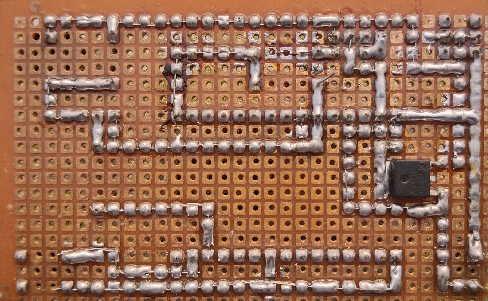

# LPG Detection and Alerting  
`LPG Detection and Alerting` system used to measure the LPG levels around it publish the data for monitoring and controlling and also it send automatic alerts.

  

## Working
the `MQ-6 LPG sensor` measures the LPG in the surroundings and outputs corresponding voltage. The voltage is read by the `ESP8266 NodeMCU` Microcontroller with it's 10Bit ADC(Analog to digital Converter). The measured value is published to a topic using the `MQTT` protocol to the MQTT Broker. It also sends the Alert SMS using an `Circuit Digest API` to the registered Mobile number. 

A Custom Webpage is designed For monitoring the Live LPG value in the Graph and a Gauge. If the LPG level exceeds the Threshold value then it will Turn ON the buzzer and the user Must turn off it using the User button on the board or the `Terminate Button` on the webpage. We can set the threshold levels from the website. 

[View Schematic](schematic/LPG-detection-alerting-schematic.pdf)
